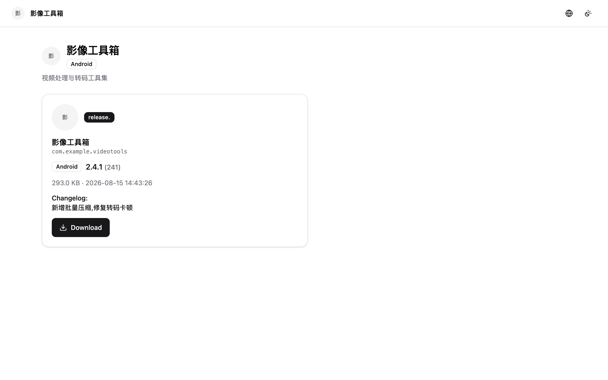
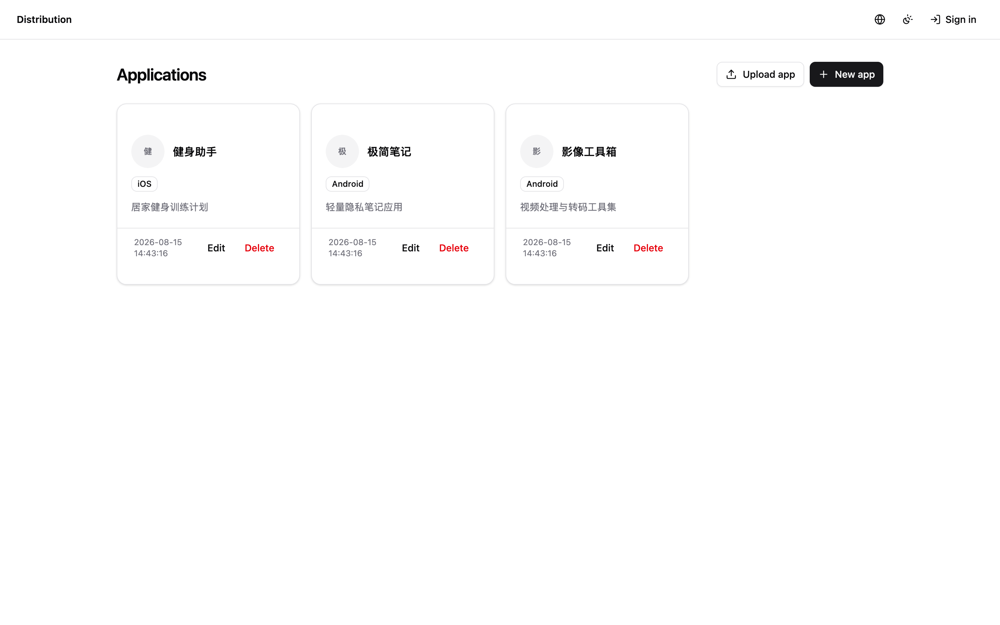
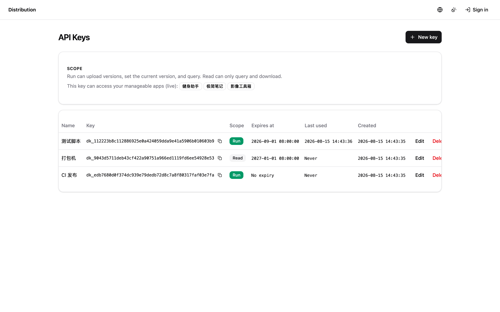

# disapp — App Distribution Platform

Self-hosted app distribution platform for iOS (IPA) & Android (APK). Upload
versions, manage apps per-team, publish, and download — with API-key access for
CI pipelines.

## Features

- **Version hosting** — upload APK/IPA, pick current version, changelog, per-version
  download/install counters and stats charts
- **Single-platform apps** — each app is `ios` or `android`; `(platform, appid)`
  is unique app-wide, and the appid is locked on the first version upload
- **Publishing** — app-level on/off switch; only the current version of a published
  app is visible publicly
- **Access control** — password-protected versions, optional app expiry
- **Team management** — app members decide who can manage each app; super-admin
  (defined in `config.json`, `uid = -1`) manages everything
- **API keys** — CI/script access via `?apikey=` with `run`/`read` scope and
  optional expiry; a key's reach is its creator's manageable apps, resolved live
- **Direct download links** — built from the request `Host` header, so reverse-proxied
  deployments return the real external host
- **Bilingual UI** — Chinese / English, auto-detected from the browser locale

## Tech stack

| Layer    | Tech |
|----------|------|
| Frontend | Vue 3 + Vite + TypeScript + Tailwind CSS v4 + shadcn-vue |
| Backend  | Go, standard-library HTTP (`mux.HandleFunc("METHOD /path")`) |
| Storage  | GORM + SQLite (pure Go, no CGO) |
| Files    | local directory or Tencent Cloud COS |
| Auth     | JWT (golang-jwt), super-admin from config |

## Project layout

```
frontend/      Vue 3 + Vite + TS + Tailwind v4 + shadcn-vue
backend/
  main.go       entry point: wires config/DB/storage/service
  internal/
    controller/ HTTP handlers (thin: parse → service → JSON)
    service/     business logic (DB/storage/validation)
    router/      Routes + static files
    resources/   config · store/{db,model} · storage/{local,cos}
  static/      embed.FS root — frontend dist is copied here at build time
.github/workflows/release.yml   tag push → cross-compiled GitHub Release
```

## Screenshots

Public download page (no login needed, `/` app list → app detail):



Admin console (app list):



API key management:



More in [docs/screenshots/](docs/screenshots/): login page, app detail, user
management, API reference, and more.

## Quick start

```bash
# Frontend type-check + build
cd frontend && npm install && npm run build

# Backend build + test
cd backend && go build -o ../bin/disapp . && go test ./...

# Wipe local DB (dev only)
make reset
```

### Dev workflow (hot-reload)

Two terminals:

```bash
cd backend && APP_CONFIG=../config.json go run .    # :8080
cd frontend && npm run dev                                      # :5173 → proxy /api → :8080
```

Open http://localhost:5173. Frontend uses hash routing, so any SPA path works.

## Configuration

All config lives in a JSON file (`APP_CONFIG`, defaults to `./config.json`):

```jsonc
{
  "server":  { "addr": ":8080" },
  "database":{ "dsn": "./data/app.db" },
  "storage": {
    "backend": "local" /* or "cos" */,
    "local":   { "dir": "./data/files" },
    "cos": {
      "secret_id": "...", "secret_key": "...",
      "bucket": "app-dist-1250000000", "region": "ap-guangzhou", "base_url": "..."
    }
  },
  "jwt":    { "secret": "change-me", "expire": "24h" },
  "admin":  { "username": "admin", "password": "admin123" }
}
```

> Leave the `admin` block empty to run without a super-admin (then all admin
> endpoints are unreachable). The super-admin is never stored in the DB.

There are **no migrations** — GORM auto-migrates the schema on startup. If the
schema changes, rebuild from scratch (dev only): `make reset`.

## Roles

| Role | How it works |
|------|--------------|
| Super-admin | `config.json` `admin` block, JWT `uid = -1`. Manages every app, every user, all API keys (sees owners) |
| App member | A user listed in an app's members can manage that app (upload versions, edit, set current) |
| Regular user | Can create apps and manage their own members/keys |

## API keys

Keys are created in the **API Keys** page. Auth via the `?apikey=` query
parameter, no JWT needed:

```bash
curl "https://your-host/api/v1/keys/123/versions?apikey=dk_xxxx"
```

- **Scope**: `run` (upload version, set current) or `read` (query/download only)
- **Expiry**: optional preset (never / 1d / 3d / 7d / 1m / 6m / 1y)
- **Reach**: the key acts as its creator — manageable apps resolved live
- **Visibility**: keys are private to their owner; super-admin sees all

Endpoints (app `id` is the numeric ID, `appid` is the package/bundle name):

| Method | Path | Scope |
|--------|------|-------|
| POST | `/api/v1/keys/{id}/versions` | run (upload new version) |
| POST | `/api/v1/keys/{id}/current` | run (set current version) |
| GET  | `/api/v1/keys/{id}/versions` | run / read |
| GET  | `/api/v1/keys/{id}/current` | run / read |
| GET  | `/api/v1/keys/{id}/current/download` | run / read (direct link) |

The full reference (params, response samples) is under **API Keys → API Reference**
in the UI.

## Download URLs & reverse proxies

Download endpoints return **absolute URLs** built from the request `Host` header
(falling back to `X-Forwarded-Host`). Behind a reverse proxy you must pass the
real external host, e.g. nginx:

```nginx
location / {
    proxy_set_header Host $host;               # real external host
    proxy_set_header X-Forwarded-For  $remote_addr;
    proxy_pass http://127.0.0.1:8080;
}
```

## Release build (CI)

Pushing a `v*` tag triggers `.github/workflows/release.yml`, which builds the
frontend, embeds it, cross-compiles the backend for `linux/amd64`, `linux/arm64`,
`darwin/amd64`, `darwin/arm64`, and attaches the binaries + `sha256` checksums to
a GitHub Release:

```bash
git tag v1.0.0
git push origin v1.0.0
```

## Deployment

Run the single binary — it serves both the API and the bundled SPA:

```bash
APP_CONFIG=/etc/disapp/config.json ./bin/disapp &
```