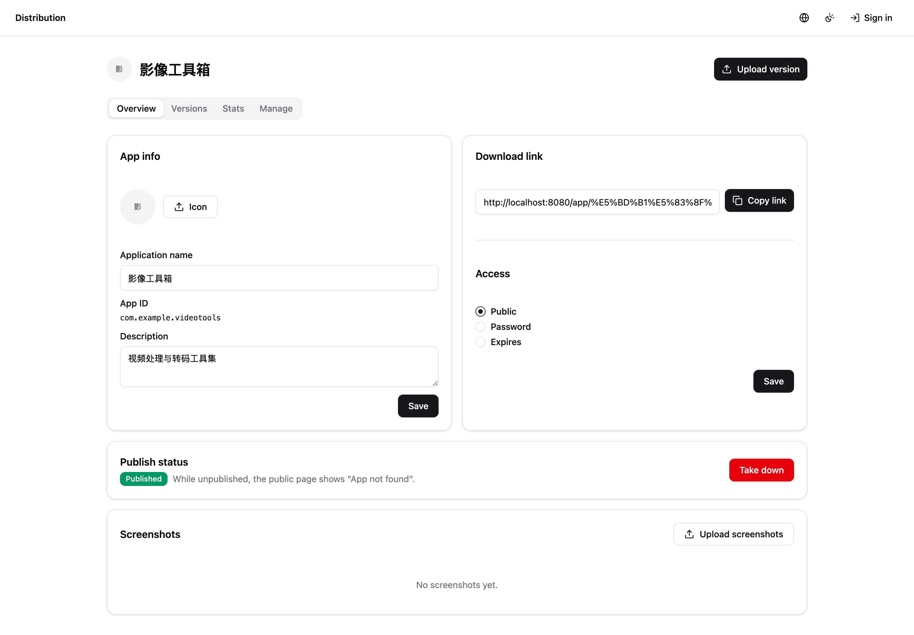

# disapp — 应用分发平台

自托管应用分发平台，支持 iOS（IPA）与 Android（APK）。上传版本、按团队管理应用、上下架、下载分发，并提供 API Key 供 CI 流水线调用。

## 功能特性

- **版本托管** — 上传 APK/IPA，设置当前版本、更新日志，按版本统计下载/安装次数与趋势图
- **单平台应用** — 每个应用固定 `ios` 或 `android`；全局 `(platform, appid)` 唯一，首次上传版本时锁定 appid
- **上下架** — 应用级开关；仅上架应用的当前版本对外可见
- **访问控制** — 应用级访问模式（`public` 公开 / `password` 密码），下载链接有效期与密码解耦，按日期粒度设置；凭据经查询参数随链接传递
- **Webhook 通知** — 订阅「版本上传 / 设为当前 / 发布下架 / 到期」事件，模板化请求体推送（`{{.key}}` 占位符），支持未保存配置试推与推送日志
- **桌面二维码** — 电脑端访问应用详情页展示二维码，手机扫码直达下载
- **团队管理** — 应用成员决定谁能管理该应用；超管（配置于 `config.json`，`uid = -1`）管理一切
- **API Key** — 通过 `?apikey=` 供 CI/脚本调用，支持 `run`/`read` 权限与有效期；key 的可用范围 = 创建人当前可管理的应用，实时生效
- **下载直链** — 链接主机名取自请求 `Host` 头，反向代理部署时返回真实外部域名
- **双语界面** — 中文 / 英文，按浏览器语言自动切换

## 技术栈

| 层 | 技术 |
|----|------|
| 前端 | Vue 3 + Vite + TypeScript + Tailwind CSS v4 + shadcn-vue |
| 后端 | Go，标准库 HTTP（`mux.HandleFunc("METHOD /path")`） |
| 存储 | GORM + SQLite（纯 Go，无 CGO） |
| 文件 | 本地目录、腾讯云 COS 或 Oracle 对象存储（S3 兼容） |
| 前端图床 | `qrcode`（桌面端二维码生成） |
| 认证 | JWT（golang-jwt），超管由配置定义 |

## 目录结构

```
frontend/      Vue 3 + Vite + TS + Tailwind v4 + shadcn-vue
backend/
  main.go       入口：组装 config/DB/storage/service
  internal/
    controller/ HTTP 处理器（薄：解析 → 调 service → 写 JSON）
    service/     业务逻辑（DB/存储/校验）
    router/      Routes + 静态文件
    resources/   config · store/{db,model} · storage/{local,cos,oci}
  static/      可选 —— 加 `-tags dist` 才内嵌前端 dist
.github/workflows/release.yml   tag 推送 → 跨平台编译并发布 GitHub Release
```

## 界面截图

公开下载页（无需登录，首页 `/` 为空白占位；通过应用详情直链访问）：



公开应用详情页（桌面端附带二维码）：


管理后台（应用列表）：


API Key 管理：


更多截图见 [docs/screenshots/](docs/screenshots/)：登录页、应用详情、用户管理、API 参考文档等。

## 快速开始

```bash
# 前端构建
cd frontend && npm install && npm run build

# 后端构建 + 测试（默认不内嵌前端；`-tags dist` 才内嵌）
cd backend && go build -o ../bin/disapp . && go test ./...

# 重置本地数据库（仅开发）
make reset
```

### 开发热重载

两个终端：

```bash
cd backend && APP_CONFIG=../config.json go run .    # :8080
cd frontend && npm run dev                                      # :5173 → 代理 /api → :8080
```

访问 http://localhost:5173。前端使用 hash 路由，任意 SPA 路径可直接访问。

## 配置

全部配置在 JSON 文件（`APP_CONFIG` 指定，默认 `./config.json`）：

```jsonc
{
  "server":  { "addr": ":8080" },
  "database":{ "dsn": "./data/app.db" },
  "storage": {
    "backend": "local" /* 或 "cos" / "oci" */,
    "local":   { "dir": "./data/files" },
    "cos": {
      "secret_id": "...", "secret_key": "...",
      "bucket": "app-dist-1250000000", "region": "ap-guangzhou", "base_url": "..."
    },
    "oci": {
      "access_key": "...", "secret_key": "...",
      "bucket": "app-dist", "namespace": "...", "region": "ap-singapore-1", "base_url": "..."
    }
  },
  "jwt":    { "secret": "change-me", "expire": "24h" },
  "admin":  { "username": "admin", "password": "admin123" }
}
```

> `admin` 块留空则运行时不带超管（此时所有管理端接口不可用）。超管从不写入数据库。

**无迁移机制** — GORM 启动时自动建表。schema 变更后需重建（仅开发）：`make reset`。

### 访问控制

- 每个应用 `access_mode`：`public`（公开下载）或 `password`（需密码访问）
- 下载链接有效期与是否设密码解耦：可设 `expires_at`（日期粒度），过期后详情返回「应用不存在」
- 链接中的密码、token 经查询参数传递，复制/转发即可分发

## 角色权限

| 角色 | 说明 |
|------|------|
| 超管 | 来自 `config.json` 的 `admin` 块，JWT `uid = -1`。可管理所有应用、所有用户、所有 API Key（可见创建人） |
| 应用成员 | 被加入某应用 members 的用户可管理该应用（上传版本、编辑、设置当前版本） |
| 普通用户 | 可创建应用，管理自己应用的成员与 key |

## API Key

在「API Keys」页面创建，通过 `?apikey=` 查询参数认证，无需 JWT。

**上传新版本（两段式）**——先取上传票据，推送文件字节，再创建版本记录：

```bash
# 1) 预签名：获取 {key, url}
curl -X POST "https://your-host/api/v1/keys/123/files?apikey=dk_xxxx" \
  -H "Content-Type: application/json" -d '{"file_name":"app.apk"}'

# 2) 将文件字节推送到返回的 url（COS 为 PUT，local 为 /files/upload）
curl -X PUT "…返回的 url…" --data-binary "@app.apk"

# 3) 创建版本（携带 key / file_size / sha256）
curl -X POST "https://your-host/api/v1/keys/123/versions?apikey=dk_xxxx" \
  -H "Content-Type: application/json" \
  -d '{"key":"distapp/123/0/…","file_name":"app.apk","file_size":1048576,"sha256":"…","version_name":"1.0.0","version_code":1}'
```

- **权限**：`run`（上传版本、设置当前、预签名）或 `read`（仅查询/下载）
- **有效期**：可选预设（永久 / 1 天 / 3 天 / 7 天 / 1 个月 / 6 个月 / 1 年）
- **范围**：key 等同于创建人身份，可管理的应用实时解析
- **可见性**：key 仅创建人可见；超管可见全部

端点（`id` 为数字 ID，`appid` 为包名/bundle 标识）：

| 方法 | 路径 | 权限 |
|------|------|------|
| POST | `/api/v1/keys/{id}/files` | run（获取上传票据） |
| POST | `/api/v1/keys/{id}/versions` | run（创建新版本） |
| POST | `/api/v1/keys/{id}/current` | run（设置当前版本） |
| GET  | `/api/v1/keys/{id}/versions` | run / read |
| GET  | `/api/v1/keys/{id}/current` | run / read |
| GET  | `/api/v1/keys/{id}/current/download` | run / read（下载直链） |

完整参考（参数、响应示例）见界面「API Keys → API Reference」。

## Webhook 通知（订阅机器人）

在「订阅」页创建机器人：绑定应用、选择请求方法（POST/GET/PUT）、URL、请求头、事件与请求体模板。请求体支持 `{{.key}}` 占位符替换：

| 参数 | 说明 |
|------|------|
| `event` / `event_key` | 事件中文名 / 原始键（`version_uploaded`、`version_current`、`app_publish`、`app_expire`） |
| `app_id` / `app_name` | 应用 ID / 名称 |
| `version_id` / `version_name` / `version_code` | 版本信息（上传相关事件） |
| `file_name` / `file_size` | 文件信息 |
| `published` / `expires_at` | 上下架状态 / 到期时间 |
| `time` | 事件时间 |

- **试推** — 编辑弹窗可对未保存配置发送测试请求，也支持批量重试
- **日志** — 每次发送记录的 URL、请求体、状态码与错误
- **到期扫描** — 后台轮询应用到期，首次触发 `app_expire` 推送（以日志去重，重启不重复触发）

## 下载直链与反向代理

下载接口返回**绝对 URL**，主机名取自请求 `Host` 头（回退 `X-Forwarded-Host`）。反向代理必须透传真实外部域名，例如 nginx：

```nginx
location / {
    proxy_set_header Host $host;               # 真实外部域名
    proxy_set_header X-Forwarded-For  $remote_addr;
    proxy_pass http://127.0.0.1:8080;
}
```

## CI 发布

推送 `v*` tag 触发 `.github/workflows/release.yml`：构建前端 → 嵌入 → 后端交叉编译
`linux/amd64`、`linux/arm64`、`darwin/amd64`、`darwin/arm64`，并把二进制 + `sha256`
校验和附到 GitHub Release：

```bash
git tag v1.0.0
git push origin v1.0.0
```

## 部署

单二进制同时提供 API 与打包的 SPA：

```bash
APP_CONFIG=/etc/disapp/config.json ./bin/disapp &
```

---

其他语言：[English](README.en.md)